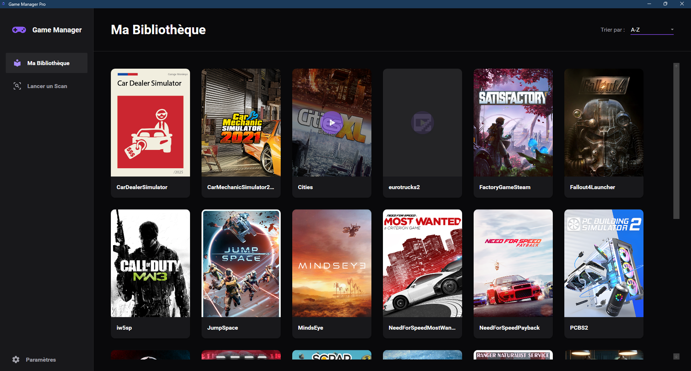
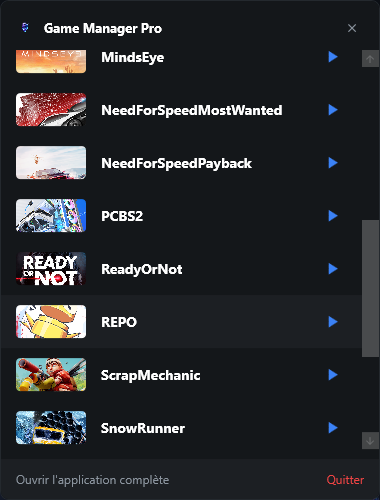

# Game Manager Pro


**Game Manager Pro** est une application Windows développée en **C# / WPF** permettant de gérer une bibliothèque de jeux locale avec une interface moderne, sombre et simple à utiliser.

L’objectif du projet est de proposer un gestionnaire de jeux propre, rapide et personnalisable, capable de scanner des dossiers, détecter les jeux installés et les afficher sous forme de bibliothèque visuelle.

---

## Aperçu

Game Manager Pro propose une interface sombre orientée productivité avec :

- Une bibliothèque de jeux claire et visuelle
- Un système de scan des répertoires
- Des jaquettes / images de jeux
- Un tri de la bibliothèque
- Une fenêtre de paramètres
- Une gestion possible en arrière-plan via le tray système
- Une architecture propre basée sur `Models`, `Services`, `ViewModels` et `Views`

---

## Captures d'écran

### Bibliothèque principale

Game Manager Pro affiche automatiquement les jeux détectés sous forme de cartes avec jaquette, nom du jeu et interface sombre moderne.



### Menu tray / lancement rapide

L'application propose aussi un menu rapide depuis la zone de notification Windows, permettant de lancer directement un jeu ou de rouvrir l'application complète.



## Fonctionnalités

### Bibliothèque de jeux

Affichage des jeux détectés sous forme de cartes visuelles avec :

- Nom du jeu
- Image / jaquette
- Organisation automatique
- Interface sombre adaptée à une utilisation desktop

### Scan local

L’application peut scanner des dossiers configurés afin de détecter les jeux présents sur la machine.

### Paramètres

Une fenêtre de paramètres permet de gérer le comportement de l’application, notamment les options liées au scan, aux chemins et au fonctionnement en arrière-plan.

### Tray système

Game Manager Pro peut rester actif en arrière-plan selon la configuration de l’utilisateur.

---

## Technologies utilisées

- **C#**
- **WPF**
- **.NET Framework 4.8**
- **MVVM**
- **Windows Desktop**

---

## Structure du projet

```txt
GameManagerPro/
├── Assets/              # Icônes, images et ressources graphiques
├── Models/              # Modèles de données
├── Services/            # Services métier : scan, paramètres, métadonnées, tray
├── ViewModels/          # Logique MVVM
├── Views/               # Fenêtres et vues WPF
├── App.xaml
├── App.xaml.cs
├── MainWindow.xaml
├── MainWindow.xaml.cs
└── GameManagerPro.csproj